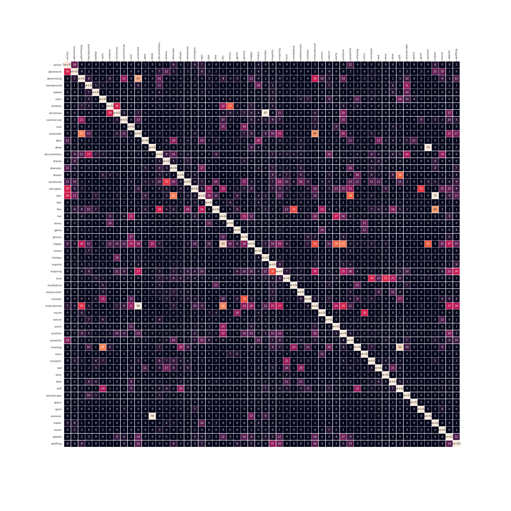

# moodtheme-tagging
This repo contains the results for MediaEval 2019 challenge results and codes.

## MediaEval
* Task description: https://multimediaeval.github.io/2019-Emotion-and-Theme-Recognition-in-Music-Task/ 

* Baseline:   
    - paper: https://arxiv.org/pdf/1606.00298.pdf   
    - code: https://github.com/keunwoochoi/music-auto_tagging-keras  

## Model Structure
### Feature extractor
Using VQ-VAE as feature extractor.

### Classifier
This is a multi-label task, which means that a sample might belongs to many classes at the same time. For example, a sample might belongs to happy, holidays, christmas at the same time.  
As a result, **sigmoid** is added after the last layer of the model, and **cross entropy loss** is used to measure the loss.  

Two kinds of classifiers:  
1. GRU
2. CNN

## Training policy  

## Future work  
In this work, we view classes as independent classes, so every class has equal chance to be selected. However, some classes are often appeared together. For example, a "holiday" song usually will also be tagged as "happy". You can see in the tag co-occurrence figure:  
  
So the next approach might be a hierarchical prediction, which means to make the classes into several groups,  and predict group first than the actual class.

## TODO
[ ] description of VA-VAE.

## acknowledgement
* VQ-VAE codes are based on this: https://github.com/ritheshkumar95/pytorch-vqvae

